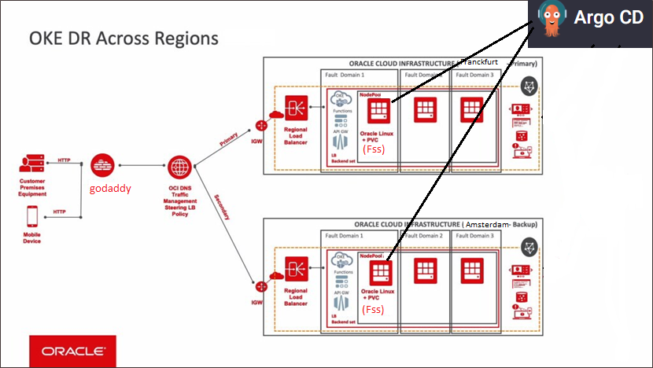
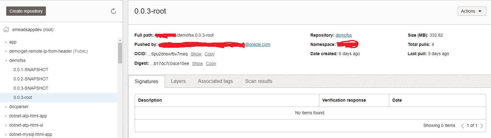
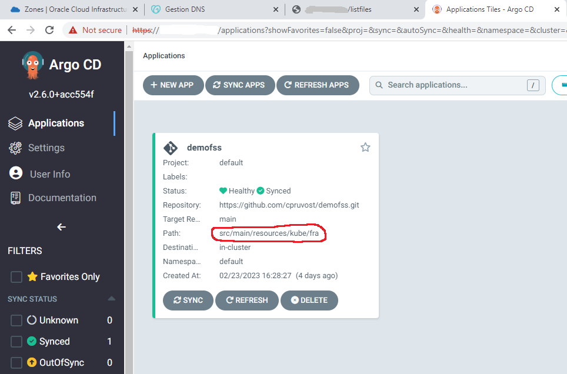
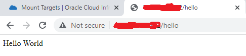
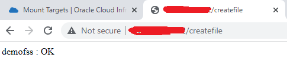
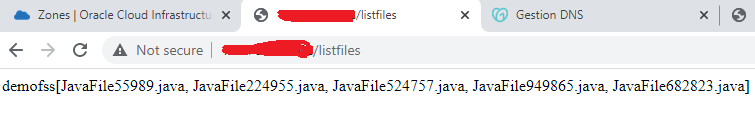
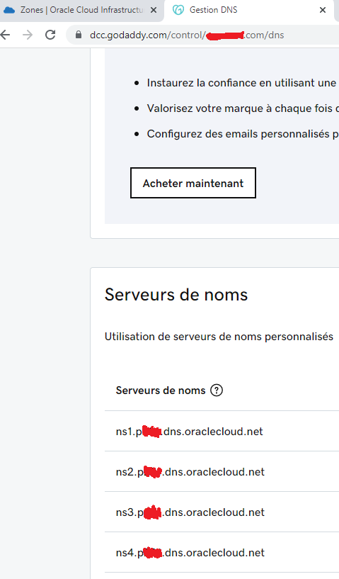
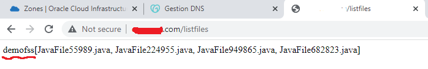
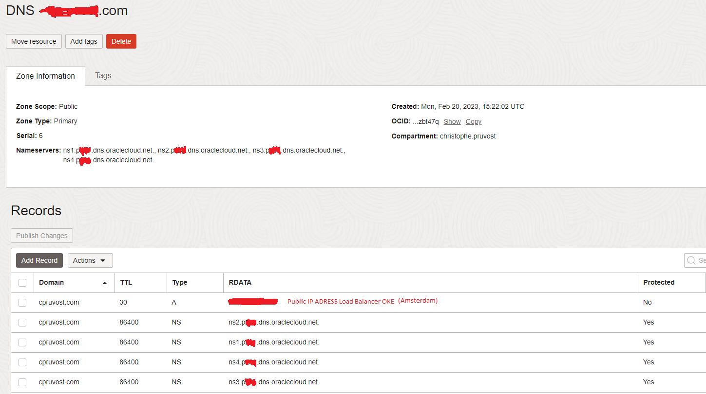
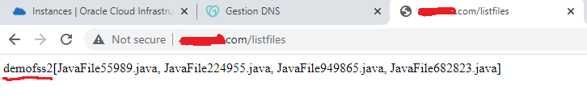

# Public Domain Name Switch from a primary OKE Cluster to a secondary OKE Cluster.
(Technologies used : Spring Boot (containerized), OCI File Storage System (with Replication), OCI OKE + OCI Registry + Argo CD, Godaddy (public domain name provider) 

Look at the Architecture of this Demo

### 0) Do a fork on this github repo to have yours.

### 1) Build the Application Docker Image and push it to OCI Registry

- Do a Maven clean package : mvn clean package.
- Build the Docker Image using a good name according to the Region of the OCI Registry (ex with Franckfurt) : docker build -t fra.ocir.io/xxxxx/demofss:0.0.3-root .
- Publish the Docker Image to the OCI Registry (after logging) : docker pull fra.ocir.io/xxxxx/demofss:0.0.3-root .

Create the Secret in order to allow OKE to get the image for the OCIR registry : kubectl create secret docker-registry queueoke-secret --docker-server='fra.ocir.io' --docker-username='xxxxx@oracle.com' --docker-password='xxxxxxx' --docker-email='xxxxx@oracle.com'

### 2) Create two OKE Cluster using the OCI Console. Ex : Primary OKE Cluster in Franckfurt and Secondary OKE Cluster in Amsterdam

### 3) Create resources (PV and PVC using FSS, Load Balancer Service) in primary OKE cluster (Region Franckfurt)

Before create a File System Storage (Fss) in Region 1 (Franckfurt) then do a replication to Region 2 (Amsterdam).
Mount the Fss to be able to use it from OKE containers. (Look at policies needed to open the good ports for Fss on TCP and UDB=P)
Update the values of the volumeHandle in the kubernetes file and after do an apply. 

Franckfurt : kubectl apply -f kubedeployfra.yaml

### 5) Install ArgoCD in primary OKE cluster (Region Franckfurt) 

Update the repoURL and after do an apply.

Franckfurt : kubectl apply -f argicdfra.yaml

Double check in the ArgoCd Console

Call the url of the Franckfurt Load Balancer (You get it with : kubectl get svc) 

Create Files in the Fss (call teh url several times)

Show the list of files that are in the Fss

### 6) Create a DNS Zone (ex : xxx.com) in the Franckfurt Region

### 7) Create a Public Domain Name (ex : xx.com with godaddy or another provider) and enter the 4 public OCI DNS Server IP

### 8) Check it runs well (after waiting several minutes)

### 9) Disaster Recovery : follow all the same steps for the Secondary OKE Cluster (In Amsterdam)

Before mounting the Fss you have 2 possibilities. You stop the replication and then you mount the Fss Target or You clone the Fss Target and you mount the Cloned Fss (We cannot mount a Fss Target with an active replication).

Then Do all the same steps like the Primary OKE Cluster

You will get a second Public IP for Amsterdam and then you will update the OCI DNS

Wait several minutes (5 to 10 minutes) and Look at the result --> The public domain name is using now the Secondary OKE Cluster

